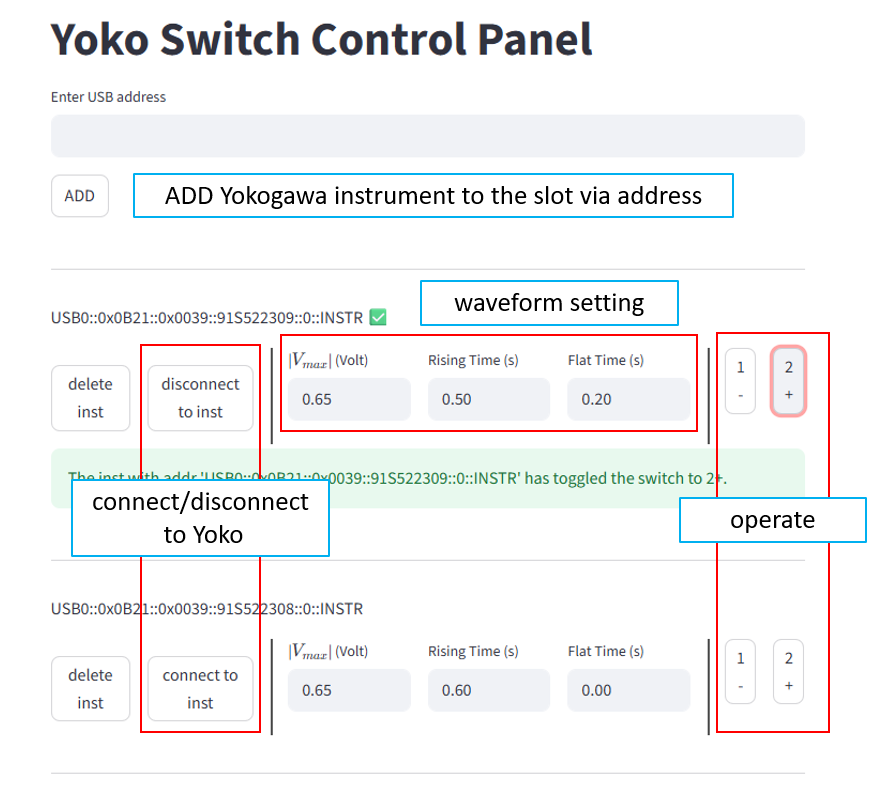

# Yoko Switch GUI Panel
An GUI panel for using YOKOGAWA to operate microwave switch.

# Usage

# Auto setup
1. windows >= 7 computer, anaconda or miniconda, git.
2. create a folder to be the workspace.
3. download `auto_setup.bat` and put inside that folder and double click to run it.

> [!Note]
> `auto_setup.bat` do the fowwling things.
> 1. setup anaconda env named `switch` if not exist.
> 2. git clone repo into current folder.
> 3. pip install modules, to the env.
> 4. open the webpage GUI.
>
> This batch file can be used as setup as well as open GUI.W